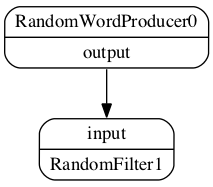

Introduction
============

dispel4py is a Python library for developing distributed data-intensive applications. 
These workflows are compositions of processing elements representing knowledge discovery activities (such as batch database querying, noise filtering and data aggregation) through which significant volumes of data can be streamed in order to manufacture a useful knowledge artefact. 
Such processing elements may themselves be defined by compositions of other, more fundamental computational elements, in essence having their own internal workflows. 
Users can construct workflows importing existing processing elements from a registry, or can define their own, recording them in a registry for later use by themselves or others.

Abstract dataflows described in dispel4py can be executed in numerous environments, for example using a Storm cluster.
Thus dispel4py allows users to construct workflows without particular knowledge of the specific context in which they are to be executed, granting the workflows greater generic applicability.

Let's start with a short example::

    from dispel4py.workflow_graph import WorkflowGraph

    from dispel4py.examples.graph_testing.testing_PEs import RandomWordProducer
    from dispel4py.examples.graph_testing.testing_PEs import RandomFilter

    # Create the components of the workflow graph
    words = RandomWordProducer()
    filter = RandomFilter()

    # Connect PEs together to form a graph
    graph = WorkflowGraph()
    graph.connect(words, 'output', filter, 'input')

This example illustrates important features of dispel4py:
 * Using and configuring processing elements
 * Creating an abstract workflow graph and indicating the data flow by connecting processing elements

We will introduce these concepts in more depth in the following chapters.

The example creates the following graph:

**Workflows**
    A workflow is a description of a distributed data-intensive application based on a streaming-data execution model. 
    It specifies the computational processes needed and the data dependencies that exist between those processes. 
    Each data element in the stream of inputs is processed by specialised computational elements which then pass on data to the next element; data is transferred using an interprocess communication network.

**Processing Elements**
    A processing element (PE) is a computational activity which encapsulates an algorithm, services and other data transformation processes — as such, PEs represent the basic computational blocks of any dispel4py workflow. 
    A dispel4py processing element has a specific structure: a class that extends :py:class:`dispel4py.GenericPE.GenericPE` and overrides the :py:func:`~dispel4py.GenericPE.GenericPE.process` method. In addition, a PE must indicate its specification as a graph node: 

    * The names of inputs and outputs
    * The input types that are consumed by the PE
    * The output types that are produced by the PE
