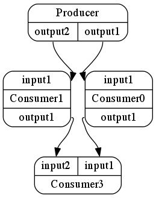

dispel4py Tools
---------------

IPython extension
=================

.. The IPython extension for Dispel4Py allows to run the commands described above within the interactive web environment of IPython. Using an interactive IPython notebook in your browser load the Dispel4Py extension package::
..
..     %load_ext dispel4py_extension
    
.. You can now list package contents in the registry, view the source of Dispel4Py components or register new Dispel4Py components using the ``%dispel4py`` command from the notebook::
..
..     %dispel4py list dispel4py.test
..     %dispel4py view eu.verce.seismo.Detrend_CM
    
The dispel4py IPython extension supports the display of the workflow graph with a layout created by the open source graph visualisation software *Graphviz dot* (http://www.graphviz.org/). If the commandline tool *dot* is installed and available on the IPython notebook server the graph of a dispel4py workflow can be displayed like this::

    from dispel4py_extension import display
    display(graph)

Interactive Processing
======================

Within an interactive Python environment (Python or IPython) a graph can be enacted using the simple (sequential) mapping by invoking :py:func:`~dispel4py.new.simple_process.process_and_return`. This function collects and returns data items written to any "hanging" outputs i.e. unconnected output streams in the graph. The input parameters to the function are the graph and the input data for the enactment. The input data is a dictionary mapping a PE to either a list of input data items or the number of iterations that are to be executed.

The following example processes 10 iterations of the random word producer PE and pipes it to a filter that randomly removes items from the list:: 

    from dispel4py.workflow_graph import WorkflowGraph

    from dispel4py.examples.graph_testing.testing_PEs import RandomWordProducer
    from dispel4py.examples.graph_testing.testing_PEs import RandomFilter

    # Create the components of the workflow graph
    words = RandomWordProducer()
    filter = RandomFilter()

    # Connect PEs together to form a graph
    graph = WorkflowGraph()
    graph.connect(words, 'output', filter, 'input')

    # Execute the graph by invoking RandomWordProducer 10 times
    from dispel4py.new.simple_process import process_and_return as simple_process
    simple_process(graph, {words: 10})

The result is a dictionary containing data from any unconnected outputs. In this example, the filter PE randomly selected and removed 3 of the 10 items in the input list and wrote the remaining 7 items to its output stream::

    {'RandomFilter1': {'output': [['analysis'],
       ['dispel4py'],
       ['dispel4py'],
       ['simple'],
       ['computing'],
       ['dispel4py'],
       ['computing']]}}